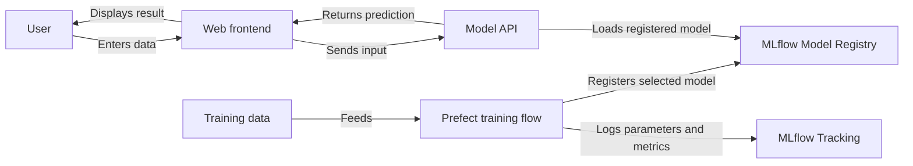
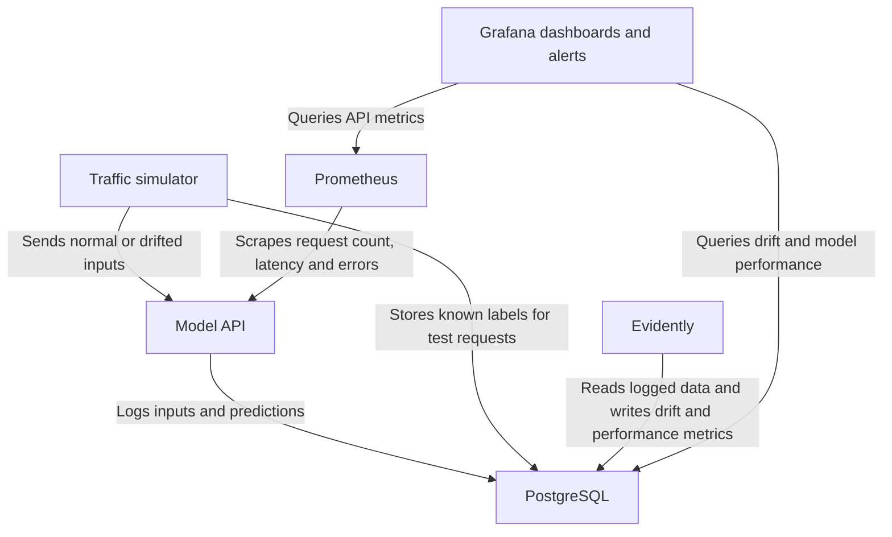

# insy684-mlops-project
## Planned Architecture

```mermaid
flowchart LR
    User[User] -->|Enters data| Frontend[Web frontend]
    Frontend -->|Sends input| API[Model API]
    API -->|Returns prediction| Frontend
    Frontend -->|Displays result| User
    Data[Training data] -->|Feeds| Train[Prefect training flow]
    Train -->|Logs parameters and metrics| Tracking[MLflow Tracking]
    Train -->|Registers selected model| Registry[MLflow Model Registry]
    API -->|Loads registered model| Registry
```

## Planned Monitoring

```mermaid
flowchart TD
    Sim[Traffic simulator] -->|Sends normal or drifted inputs| API[Model API]
    API -->|Logs inputs and predictions| DB[PostgreSQL]
    Sim -->|Stores known labels for test requests| DB
    Evidently -->|Reads logged data and writes drift and performance metrics| DB
    Prom[Prometheus] -->|Scrapes request count, latency and errors| API
    Grafana[Grafana dashboards and alerts] -->|Queries API metrics| Prom
    Grafana -->|Queries drift and model performance| DB
```
